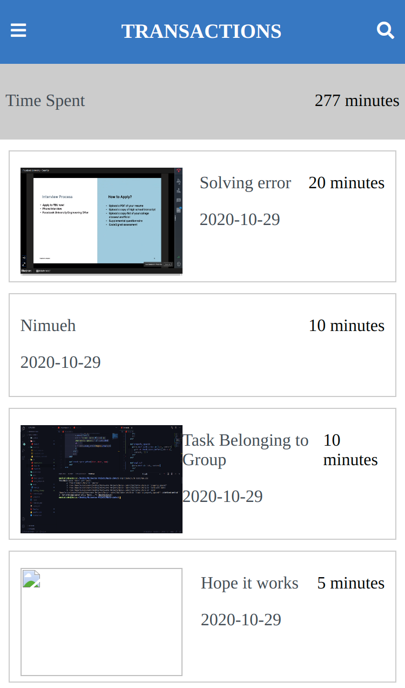

# Weka
The main objective of this project was demonstrate the technical skills required to build a fully functional MVP of a real world project. Weka is a task management application that allows one to create tasks and groups that serve as projects that other users can contribute to.




- Below is the UML diagram for the Weka Application.


## Built With

- Ruby v2.7.1
- Ruby on Rails v6.0.1

## Live Demo

[Live Demo](https://weka-pesa.herokuapp.com/)

## Video Presentation of the project

[Video Walkthrough](https://www.loom.com/share/a0b3b25e974d483ead0f89e2df87ae45)

### Usage

To use `Weka` efficiently, you have to sign up as a user. After signing up, you will be redirected to your profile page. This page contains links to help you navigate through the application efficiently. 

From within the application, you can be able to do the following:
1. Create a new independent task that isn't associated with any group.
2. Create a task that is group dependent.
3. Create a group.
4. Sign up.
5. Login.


### Getting Started
```
Open Terminal
run git clone `git@github.com:KelynPNjeri/Weka.git`
run cd Weka/
run bundle install
run rake db:create
run rake db:migrate
run rails s
```
Open `http://localhost:3000/` in your browser.

### Local AWS Installation.
- To change the AWS credentials on this application, you need to do the following:
1. To your `Gemfile` add `gem 'aws-sdk-s3', require: false`
2. Run `bundle install`
3. Edit `credentials.yml.enc` and add your `access_id` and `secret_key`. This can be accomplished by running `rails credentials:edit`

### Run tests
To run the tests:
- Run `rspec --format documentation`

### Deployment

This project has been deployed on Heroku using the `Heroku CLI` and a continuous deployment pipeline has been setup between Heroku and GitHub.
## Instructions
As a new user, you need to create a new account so as to be able to create new tasks, new groups or contribute to other people's Groups.

## Authors

👤 **Kelyn Paul Njeri**

- Github: [@abouhid](https://github.com/KelynPNjeri)
- LinkedIn: [Alexandre Bouhid](https://www.linkedin.com/in/kelyn-paul/)

## 🤝 Contributing

Contributions, issues and feature requests are welcome!

## Show your support

Give a ⭐️ if you like this project!

## Acknowledgments

- Microverse
- GitHub
- TheOdinProject
- Ruby on Rails

